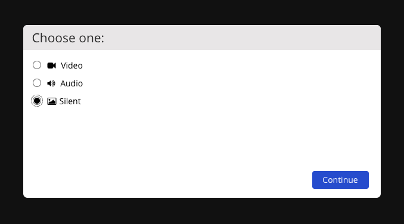
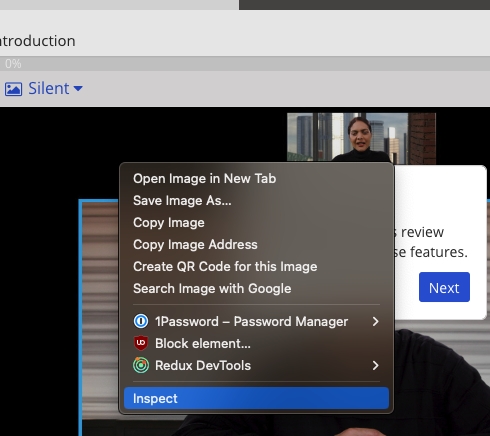
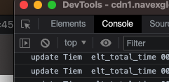

# Navex Skip

Skip annoyingly long Navex Training by running a script in the JS console.

How To:

1. Start your quiz, a new browser window will open

2. For this to work you have to take a `Silent` training. At the start you should see three options: Video, Audio, and Silent. Select the Silent option.
 and click `Continue`.

3. Right click anywhere on the quiz page and select inspect option 

4. In the developer tools that just opened, open the Console 

5. Paste the contents of the skip.js file, or from the bottom of this document, into the console and press Enter. You should see the training solving itself.

## Drag and drop quiz

At the moment this script cannot handle drag and drop so you will have to solve that yourself. Once you're past that just type `run()` in the console and script should continue.

```js
var combine = function(a, min) {
  var fn = function(n, src, got, all) {
      if (n == 0) {
          if (got.length > 0) {
              all[all.length] = got;
          }
          return;
      }
      for (var j = 0; j < src.length; j++) {
          fn(n - 1, src.slice(j + 1), got.concat([src[j]]), all);
      }
      return;
  }
  var all = [];
  for (var i = min; i < a.length; i++) {
      fn(i, a, [], all);
  }
  all.push(a);
  return all;
}

function getSilentButton() {
  var xpath = "//i[contains(text(),\"Silent \")]";
  return document.evaluate(xpath, document, null, XPathResult.FIRST_ORDERED_NODE_TYPE, null).singleNodeValue;
}

function getContinueButton() {
  var xpath = "//button[contains(text(),\"Continue\")]";
  return document.evaluate(xpath, document, null, XPathResult.FIRST_ORDERED_NODE_TYPE, null).singleNodeValue;
}

function getTryAgainButton() {
  var xpath = "//button[contains(text(),\"Try Again\")]";
  return document.evaluate(xpath, document, null, XPathResult.FIRST_ORDERED_NODE_TYPE, null).singleNodeValue;
}

async function solveQuiz() {
  var radioOptions = Array.prototype.slice.call(document.querySelectorAll('app-option-text input[type=radio]'));
  var checkboxOptions = Array.prototype.slice.call(document.querySelectorAll('app-option-text input[type=checkbox]'));
  console.log("solving quiz");
  for (o of radioOptions) {
    o.click();
    await new Promise(r => setTimeout(r, 100));
    var submitButton = document.querySelector('button#quiz-submit-btn');
    if (submitButton) {
      submitButton.click();
    }
    await new Promise(r => setTimeout(r, 100));
    var tryAgainButton = getTryAgainButton();

    if (tryAgainButton) {
      tryAgainButton.click();
    } else {
      return;
    }
  };
  if (checkboxOptions) {
    return await solveCheckboxQuiz(checkboxOptions);
  }
}

async function solveCheckboxQuiz(options) {
  var allPermutations = combine(options, 1);
  for (p of allPermutations) {
    Array.from(document.querySelectorAll('.option-text-selected')).forEach(function(e) {e.click()})

    for (o of p) {
      o.click();
    }
    await new Promise(r => setTimeout(r, 100));
    var submitButton = document.querySelector('button#quiz-submit-btn');
    if (submitButton) {
      submitButton.click();
    }
    var tryAgainButton = getTryAgainButton();

    if (tryAgainButton) {
      tryAgainButton.click();
    } else {
      return;
    }
  }
}

async function click_buttons() {
  var loader = document.querySelector('div.loader');
  if (loader) {
    console.log("loader found, waiting");
    await new Promise(r => setTimeout(r, 1000));
    return click_buttons();
  }
  var continueButton = getContinueButton();

  if (continueButton) {
    continueButton.click();
  }

  var feedbackClose = document.querySelector('.feedback-con .fa-times');

  if (feedbackClose) {
    feedbackClose.click();
  }

  var appQuiz = document.querySelector('app-quiz');
  if (appQuiz) {
    await solveQuiz();
  }

  var quad = document.querySelector('.quad:not(.selected)');

  if (quad) {
    quad.click();
  }


  var spot = document.querySelector('.hot-spot-enabled');
  if (spot) {
    var spotArrowRight = document.querySelector('.fa-arrow-right');
    if (spotArrowRight) {
      console.log("spot arrow found, clicking");
      spotArrowRight.click();
    } else {
      console.log("Spot found, clicking");
      spot.click();
    }
  }
  var close = document.querySelector('.closeBtnhotspot');
  if (close) {
    console.log("close button found, clicking");
    close.click();
  }

  var image = document.querySelector('.option-con.enabled:not(.visited)')

  if (image) {
    console.log("image found, clicking");
    image.click();
  }

  var arrowNext = document.querySelector('div.arrow-right:not(.disabled) button')

  if (arrowNext) {
    console.log("next arrow found, clicking");
    arrowNext.click();
  }

  var arrowRight = document.querySelector('div.arrow-right:not(.disabled) .nextBtn');
  if (arrowRight) {
    arrowRight.click();
  }

  var next = document.querySelector('#next-btn:not(.btn-disabled)');
  if (next) {
    console.log("next button found, clicking");
    next.click();
  }

  var choice = document.querySelector('.choices:not(.disabledsummary)');

  if (choice) {
    choice.click();
  }

  var confidence = null;

  if (document.querySelector('div.con-question-confidence')) {
      confidence = document.querySelector('.option-wrapper:nth-child(4)>div:not(.selected)');
  }

  if (confidence) {
    confidence.click();
    var confidenceSubmit = document.querySelector('.con-option-holder-con > button:not(.disabled):not(.btn-disabled');
    if (confidenceSubmit) {
      confidenceSubmit.click();
    }
  }

  if (continueButton || quad || feedbackClose || spot || close || image || arrowNext || arrowRight || choice || confidence || appQuiz) {
    await new Promise(r => setTimeout(r, 100));
    click_buttons()
  } else if (next) {
    await new Promise(r => setTimeout(r, 1000));
    click_buttons()
  } else {
    console.log("No actionable elements found, exiting");
  }

}

function run() {
  try {
    click_buttons();
  } catch {
    click_buttons();
  }
}

run();
```
